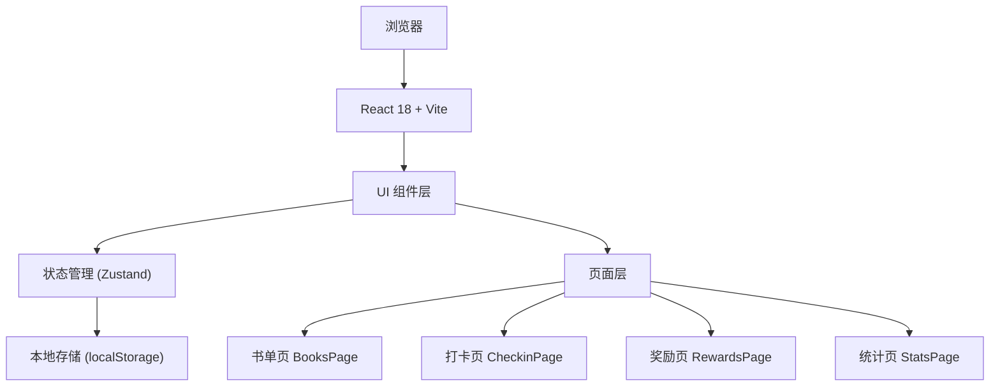
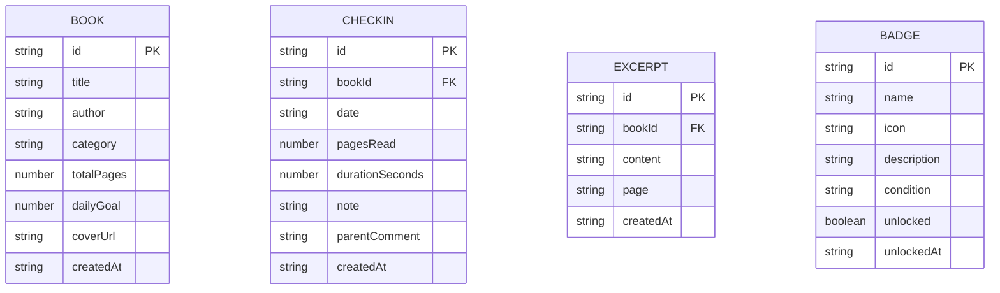

## 1. 架构设计



## 2. 技术说明

- **前端框架**：React@18 + TypeScript
- **构建工具**：Vite
- **样式方案**：Tailwind CSS 3
- **状态管理**：Zustand（轻量级状态管理，支持持久化中间件）
- **路由方案**：React Router DOM（HashRouter，纯前端适用）
- **图标库**：Lucide React
- **数据存储**：localStorage（纯本地存储，无需后端）
- **初始化工具**：vite-init（react-ts 模板）

## 3. 路由定义

| 路由 | 用途 |
|------|------|
| / | 重定向到 /books |
| /books | 书单页 - 图书管理与目标设置 |
| /checkin | 打卡页 - 每日打卡、计时器、摘抄 |
| /rewards | 奖励页 - 勋章墙与解锁状态 |
| /stats | 统计页 - 周报、完成率、打印 |

## 4. 数据模型

### 4.1 数据模型定义



### 4.2 Zustand Store 状态结构

```typescript
interface ReadingStore {
  // 图书列表
  books: Book[];
  // 打卡记录
  checkins: Checkin[];
  // 摘抄收藏
  excerpts: Excerpt[];
  // 勋章
  badges: Badge[];
  
  // Actions
  addBook: (book: Omit<Book, 'id' | 'createdAt'>) => void;
  removeBook: (id: string) => void;
  updateBook: (id: string, data: Partial<Book>) => void;
  
  addCheckin: (checkin: Omit<Checkin, 'id' | 'createdAt'>) => void;
  addExcerpt: (excerpt: Omit<Excerpt, 'id' | 'createdAt'>) => void;
  removeExcerpt: (id: string) => void;
  
  unlockBadge: (badgeId: string) => void;
  checkAndUnlockBadges: () => void;
  
  // 查询方法
  getStreakDays: () => number;
  getWeeklyStats: () => WeeklyStats;
  getMostReadBooks: () => { book: Book; totalPages: number }[];
}
```

## 5. 项目目录结构

```
src/
├── components/           # 通用组件
│   ├── Navbar.tsx        # 顶部导航
│   ├── BookCard.tsx      # 图书卡片
│   ├── ProgressBar.tsx   # 进度条
│   ├── Timer.tsx         # 计时器
│   ├── BadgeIcon.tsx     # 勋章图标
│   ├── Modal.tsx         # 弹窗组件
│   └── StatsCard.tsx     # 统计卡片
├── pages/                # 页面组件
│   ├── BooksPage.tsx     # 书单页
│   ├── CheckinPage.tsx   # 打卡页
│   ├── RewardsPage.tsx   # 奖励页
│   └── StatsPage.tsx     # 统计页
├── store/                # 状态管理
│   └── useReadingStore.ts
├── types/                # 类型定义
│   └── index.ts
├── utils/                # 工具函数
│   ├── date.ts           # 日期处理
│   ├── storage.ts        # 存储工具
│   └── badges.ts         # 勋章逻辑
├── App.tsx               # 根组件
├── main.tsx              # 入口
└── index.css             # 全局样式
```

## 6. 勋章定义

| 勋章ID | 名称 | 图标 | 解锁条件 |
|--------|------|------|----------|
| first-book | 书虫启程 | 📚 | 添加第一本图书 |
| first-checkin | 初次打卡 | ✨ | 完成第一次打卡 |
| streak-7 | 七天坚持 | 🔥 | 连续打卡7天 |
| streak-30 | 月度达人 | 🏆 | 连续打卡30天 |
| pages-100 | 百页读者 | 📖 | 累计阅读100页 |
| pages-500 | 半千之旅 | 🎯 | 累计阅读500页 |
| pages-1000 | 千页大师 | 👑 | 累计阅读1000页 |
| books-3 | 博览群书 | 🎓 | 读完3本书 |
| excerpt-5 | 摘抄达人 | ✍️ | 收藏5条摘抄 |
| parent-10 | 家长鼓励 | 💝 | 获得10条家长评语 |
