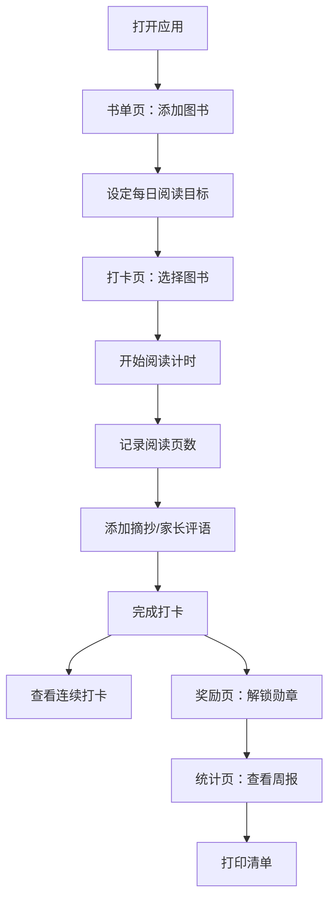

## 1. 产品概述

家庭阅读打卡计划是一款轻量级纯前端网页应用，专为家长与孩子共同制定和执行家庭阅读计划而设计。通过直观的界面设计和游戏化的激励机制，帮助家庭培养良好的阅读习惯。

- 目标用户：有学龄儿童的家庭，家长和孩子共同使用
- 核心价值：让阅读计划可视化、打卡便捷化、奖励趣味化、成长数据化
- 产品定位：零安装、即开即用的浏览器端工具，数据本地存储保护隐私

## 2. 核心功能

### 2.1 用户角色

| 角色 | 说明 | 核心权限 |
|------|------|----------|
| 家长 | 引导者与监督者 | 创建书单、设定目标、撰写评语、查看统计 |
| 孩子 | 阅读执行者 | 打卡记录、查看奖励、收集勋章 |

### 2.2 功能模块

1. **书单页**：图书管理、阅读目标设定、分类筛选、阅读进度条
2. **打卡页**：每日页数记录、阅读计时器、连续打卡显示、摘抄收藏、家长评语
3. **奖励页**：勋章系统、解锁状态展示、激励提示
4. **统计页**：周报生成、周完成率、最常读书目、打印清单

### 2.3 页面详情

| 页面名称 | 模块名称 | 功能描述 |
|-----------|----------|----------|
| 书单页 | 图书列表 | 卡片展示所有图书，显示封面、书名、作者、分类、当前进度 |
| 书单页 | 添加图书 | 弹窗表单：书名、作者、分类、总页数、每日目标页数、封面（可选） |
| 书单页 | 目标设置 | 每本书单独设置每日阅读页数目标 |
| 书单页 | 分类筛选 | 按分类标签过滤图书列表 |
| 书单页 | 进度条 | 可视化显示每本书已读/总页数比例 |
| 打卡页 | 打卡记录 | 选择图书、录入当日阅读页数、开始/暂停计时、保存打卡 |
| 打卡页 | 连续打卡 | 显示当前连续打卡天数和日历热力图 |
| 打卡页 | 摘抄收藏 | 添加/查看阅读摘抄好句 |
| 打卡页 | 家长评语 | 家长为每次打卡写评语、鼓励孩子 |
| 奖励页 | 勋章墙 | 展示所有勋章（已解锁灰色、已解锁彩色动画高亮） |
| 奖励页 | 解锁条件 | 每种勋章显示获得条件说明 |
| 奖励页 | 最近获得 | 显示最近解锁的勋章高亮提示 |
| 统计页 | 周报 | 生成最近7天阅读数据汇总 |
| 统计页 | 完成率 | 本周目标完成百分比展示 |
| 统计页 | 阅读排行 | 最常读书目TOP3排行 |
| 统计页 | 打印清单 | 可打印的阅读记录清单输出 |

## 3. 核心流程

用户首次打开应用 → 进入书单页添加图书并设定每日阅读目标 → 在打卡页选择图书开始阅读计时 → 记录页数和摘抄 → 完成打卡后查看连续打卡天数 → 在奖励页查看解锁勋章 → 在统计页查看周报和数据 → 可打印阅读记录清单

## 4. 用户界面设计

### 4.1 设计风格

- **主色调**：暖橙色系（温暖、活力、阅读氛围），搭配柔和的米黄色背景
- **辅助色**：森林绿（成长、自然）、天空蓝（清新、专注）、樱花粉（童趣、温馨）
- **按钮风格**：圆角胶囊形状，带有微阴影，hover 悬浮时轻微上浮
- **字体**：标题使用圆润活泼的字体，正文使用清晰易读的无衬线体
- **布局风格**：卡片式布局，顶部导航标签切换
- **图标风格**：使用 lucide-react 图标，配合 emoji 增加童趣

### 4.2 页面设计概览

| 页面名称 | 模块名称 | UI 元素 |
|----------|----------|---------|
| 书单页 | 图书卡片 | 圆角卡片、封面占位、进度条、分类标签、删除按钮 |
| 书单页 | 添加弹窗 | 表单输入框、下拉选择、保存/取消按钮 |
| 书单页 | 筛选栏 | 分类标签按钮组 |
| 打卡页 | 计时器 | 大号数字显示、开始/暂停/重置按钮 |
| 打卡页 | 连续打卡 | 日历格子热力图、当前连续天数徽章 |
| 打卡页 | 摘抄区 | 文本框、保存按钮、列表展示 |
| 奖励页 | 勋章墙 | 网格布局、勋章图标、解锁状态、悬停显示条件 |
| 统计页 | 周报卡片 | 数据统计卡片、进度环形图 |
| 统计页 | 阅读排行 | 排名列表、图书封面、阅读时长/页数 |

### 4.3 响应式

桌面端优先设计，移动端自适应。卡片在小屏幕下堆叠显示，触控区域足够大适合手指点击。

### 4.4 动效设计

- 页面切换使用淡入淡出过渡
- 勋章解锁时缩放+旋转动画
- 打卡成功弹出礼花效果
- 进度条增长动画
- 计时器数字跳动效果
